# Taiwan House Price Prediction with PyTorch

This is a sample project for predicting house prices using a neural network model built with PyTorch.

## Usage

1. Install the dependencies:

```bash
pip install -r requirements.txt
```


2. Data analysis:

```bash
python data_analysis.py
```
## Feature Name Translation

| Chinese Name     | English Name            |
|------------------|-------------------------|
| 行政區編號       | District ID             |
| 土地面積         | Land Area               |
| 使用分區         | Usage Zone              |
| 移轉層次         | Transfer Level          |
| 總樓層數         | Total Floors            |
| 主要用途         | Main Usage              |
| 主要建材         | Main Material           |
| 建物型態         | Building Type           |
| 屋齡             | Building Age            |
| 建物面積         | Building Area           |
| 車位面積         | Parking Area            |
| 車位個數         | Parking Count           |
| 橫坐標           | Latitude                |
| 縱坐標           | Longitude               |
| 主建物面積       | Main Building Area      |
| 陽台面積         | Balcony Area            |
| 附屬建物面積     | Attached Building Area  |

## Feature Distributions

### Distribution of District ID
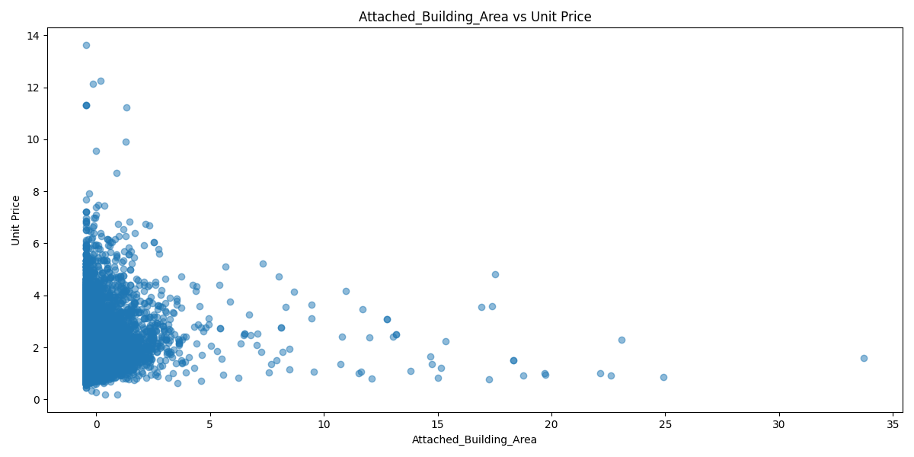

### Distribution of Land Area
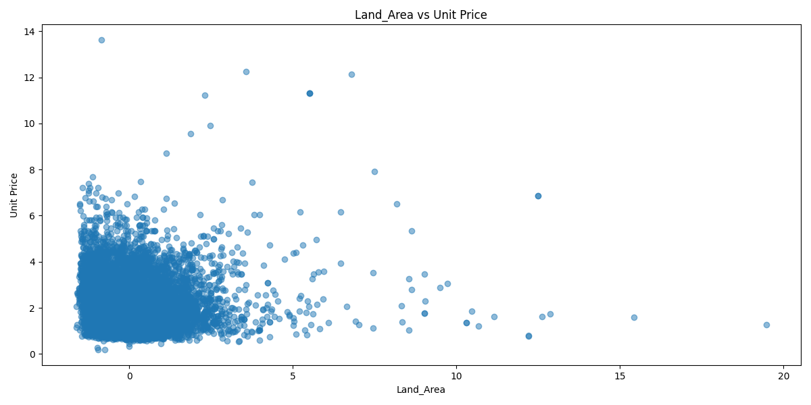

### Distribution of Usage Zone
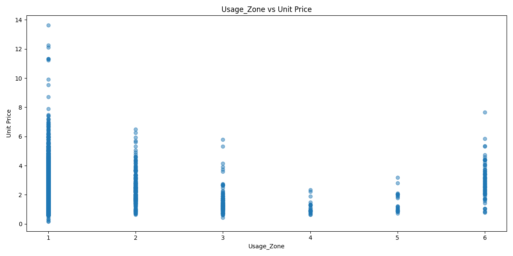

### Distribution of Transfer Level
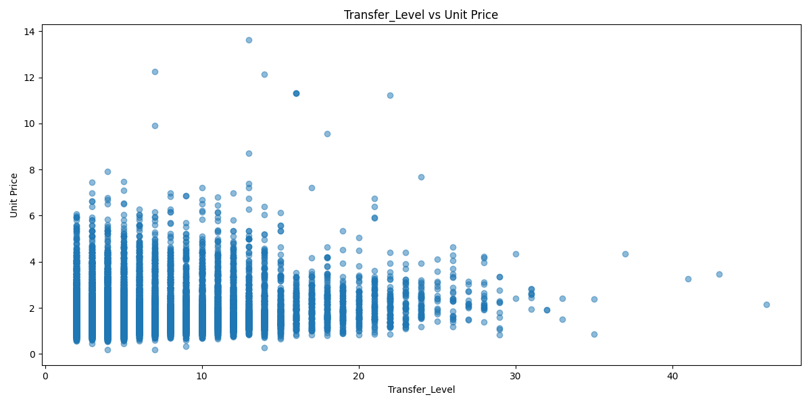

### Distribution of Total Floors
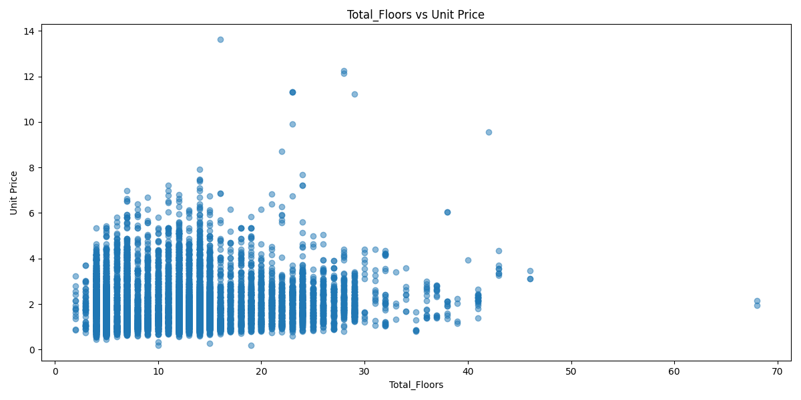

### Distribution of Main Usage
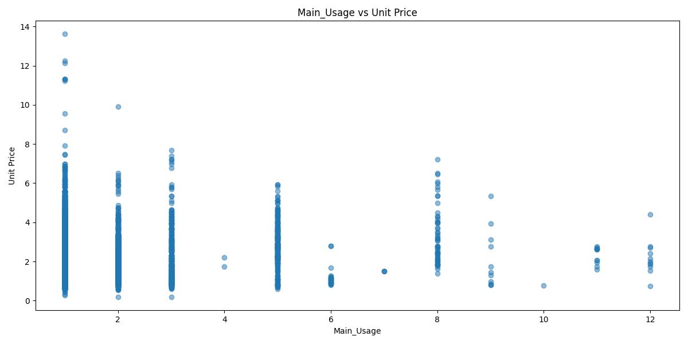

### Distribution of Main Material
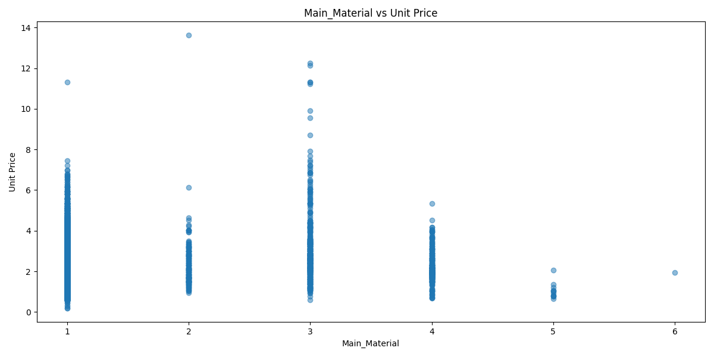

### Distribution of Building Type
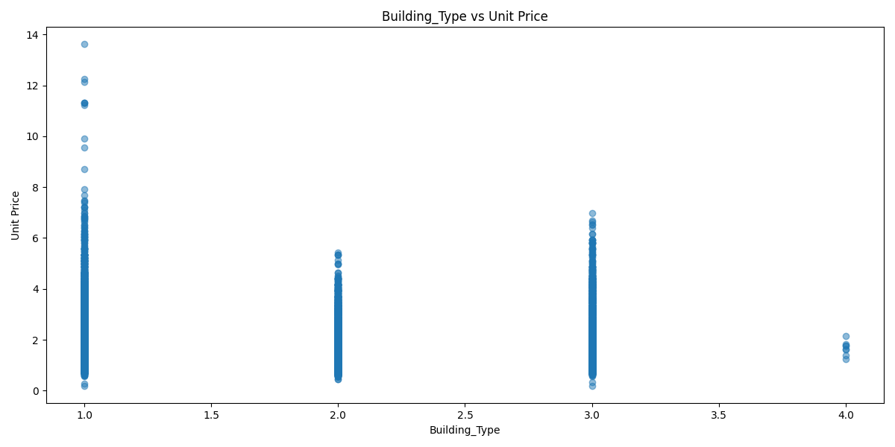

### Distribution of Building Age
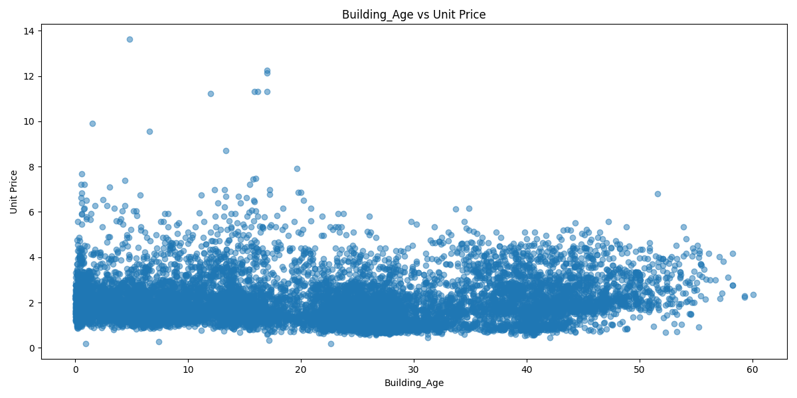

### Distribution of Building Area
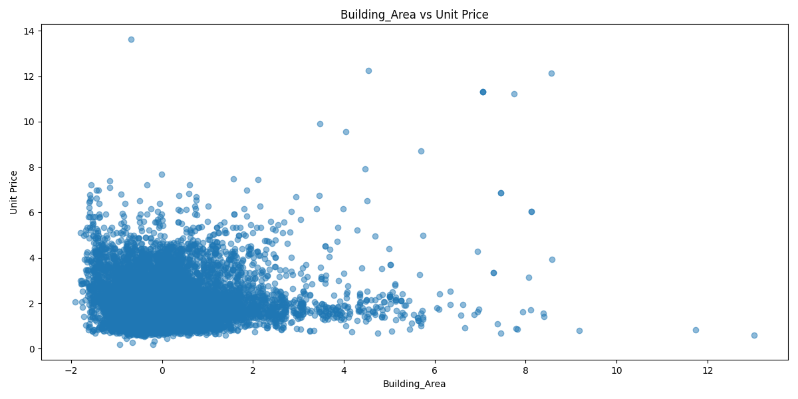

### Distribution of Parking Area
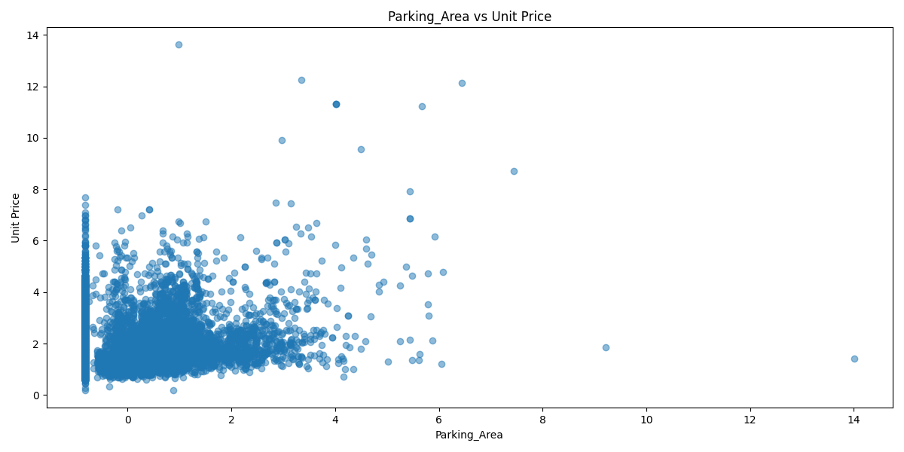

### Distribution of Parking Count
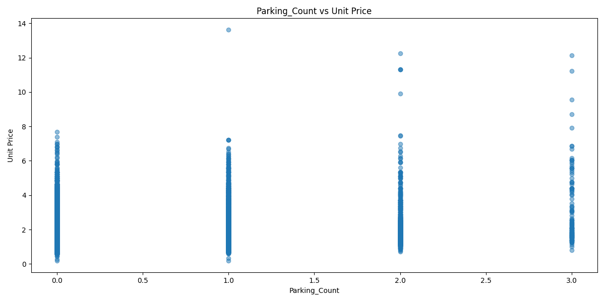

### Distribution of Latitude
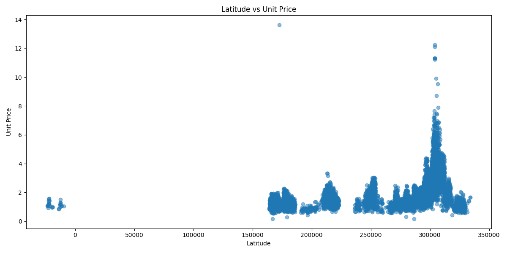

### Distribution of Longitude
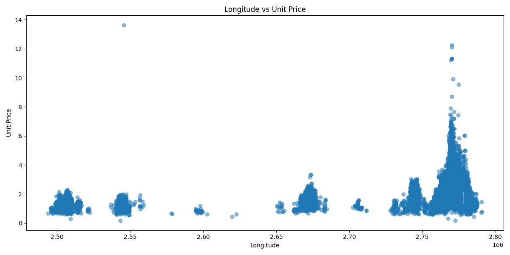

### Distribution of Main Building Area
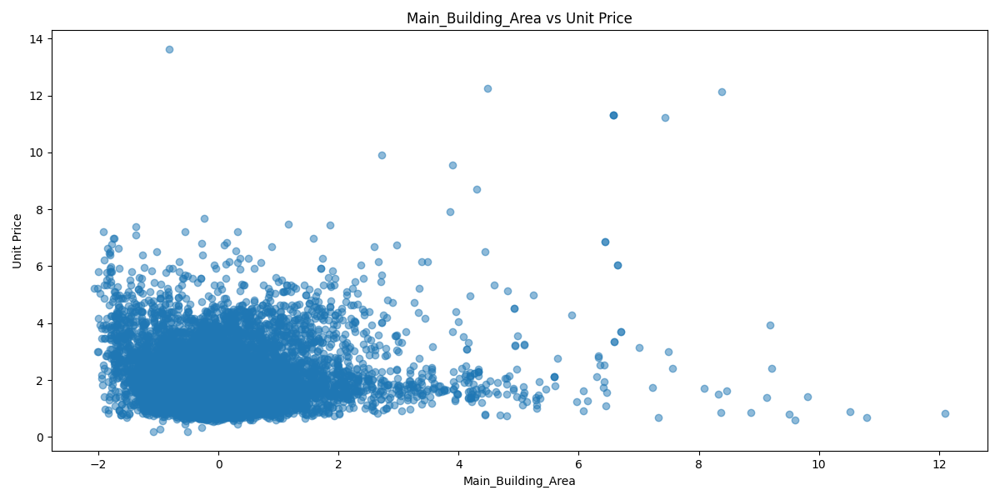

### Distribution of Balcony Area
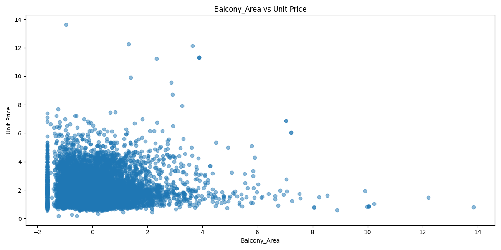

### Distribution of Attached Building Area

